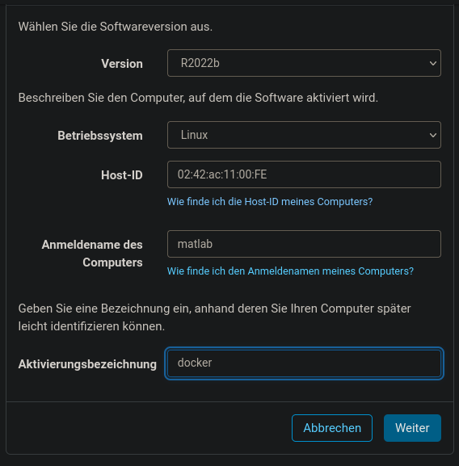

# devcontainer-templates

Templates for various devcontainers used in vscode.

## matlab

* You need to create a ML account: <https://de.mathworks.com/mwaccount/register>
* And create your license file <https://de.mathworks.com/matlabcentral/answers/235126-how-do-i-generate-a-matlab-license-file> and store it under `license/license.lic` (Select Linux, matlab as Login name and use `02:42:ac:11:00:FE` as HOST-ID)  
  

### usage

**Web interface:**
* execute `matlab-proxy-app`
* open <http://localhost:8888/index.html>

**Shell or File execution:**
* <Ctrl+Shift+P> run current script
* <Ctrl+Shift+P> run current selection
> NOTE: dont use "-" in filename  
> NOTE: MATLAB file names must start with a letter and contain only letters, numbers or underscores.

## ocaml

> Credits to <https://github.com/johnnymn/ocaml-devcontainer>

## typescript-vue
